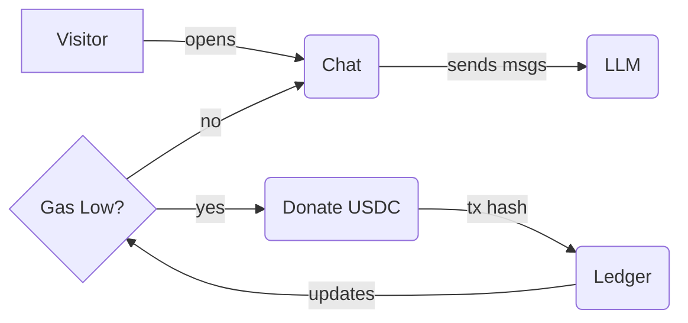

# Compassionate AI 🤝 – Anonymous Emotional Support

> **Empathy-as-a-Service.** A fully open-source, donation-powered chat companion that gives anyone a safe space to talk — with on-chain transparency and zero data harvesting.

---

## ✨ Why This Project Matters

Millions struggle silently every day. Traditional therapy is expensive or geographically out of reach. Compassionate AI delivers **24 / 7 emotional support** powered by state-of-the-art language models, while ensuring:

1. **Anonymity first** – no log-ins, no trackers, no cookies required.
2. **Radical transparency** – every donation is publicly auditable on-chain.
3. **Community ownership** – 100 % of funds power more free conversations.

---

## 🎥 Live Demo

[](https://youtu.be/your-demo-link)

<div align="center">
  
</div>

---

## 🚀 Quick Start

```bash
# 1. Clone & install dependencies
pnpm i

# 2. Copy env and add your keys
cp .env.example .env.local

# 3. Run everything (Next.js + Turborepo)
pnpm dev
```

> You'll need an **OpenRouter** API key for LLM access and a **USDC test-wallet** for donations.

---

## 🏗️ Monorepo Layout

```
apps/
  web/            # Next.js 14 (App Router)
packages/
  ui/             # Re-usable shadcn-styled components (Button, Card, …)
  eslint-config/  # Shared lint rules
  typescript-config/ # Base tsconfig
``` 

| Folder | Highlights |
|--------|------------|
| `apps/web/components` | Production-ready sections: **Landing**, **Chat**, **Donate**, **Ledger** |
| `packages/ui/src/components` | 20+ drop-in React-UI primitives (Accordion, Tooltip, …) |

---

## 🧩 Tech Stack

| Layer          | Tech | Why |
|----------------|------|-----|
| Front-end      | **Next.js 14**, **TypeScript**, **Tailwind + shadcn/ui**, **Framer Motion** | Modern, fast, accessible |
| Wallet & Chain | **wagmi**, **viem**, **USDC** | Seamless crypto-native payments |
| AI Provider    | **OpenRouter** (configurable) | Cost-effective, multi-model |
| Infra / DevX   | **Turborepo**, **pnpm**, **ESLint**, **Prettier** | Monorepo best-practices |

---

## 🔄 Main Flows



* **Chat Flow:** persistent anonymous context via secure UUID.
* **Donation Flow:** on-chain USDC triggers gas-bar refill (hours of conversation funded).

---

## 🛠️ Scripts

| Command | Description |
|---------|-------------|
| `pnpm dev` | Start Next.js (with hot-reload) |
| `pnpm lint` | ESLint + TypeScript checks |
| `pnpm build` | Production build for all apps |
| `pnpm storybook` | Component library playground *(coming soon)* |

---

## 💡 Roadmap

- [ ] Live sentiment & crisis-detection guardrails
- [ ] Multi-language support (i18n)
- [ ] Mobile PWA wrapper
- [ ] In-browser vector cache to reduce LLM calls

---

## 🤝 Contributing

We welcome PRs! Please read [`CONTRIBUTING.md`](./CONTRIBUTING.md) and join our Discord hackathon squad.

---

## 📄 License

MIT — free for personal or commercial use. If you fork, please keep it open-source and mission-aligned.

---

> **Built at ETH Belgrade 2025** with passion for mental well-being.
